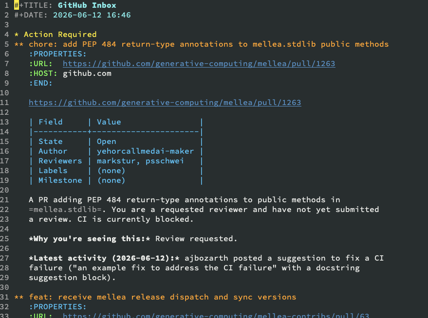

# ghn

Managing GitHub notifications with [GTD](https://gettingthingsdone.com/) and a living
[Org-mode](https://orgmode.org/) inbox.

Instead of living in GitHub's web UI, the things that need your attention land in a single
document on your laptop and stay there until you deal with them. Each run treats GitHub's
`/notifications` feed as a *delta* of what changed since the last run, folds that delta
into the doc, then marks those threads Done so they don't resurface unless something new
happens. The doc *is* the inbox; items stay until you remove them by hand.



## Making notes on an item

Every item carries an empty `:NOTES:` line in its `:PROPERTIES:` drawer. To leave
yourself a note (e.g. "check back in three days"), just type after the colon:

```org
** feat: some pull request
   :PROPERTIES:
   :URL:  https://github.com/org/repo/pull/123
   :HOST: github.com
   :LAST_SEEN: 2026-07-01T15:39:08Z
   :NOTES:  check back 2026-07-04, blocked on the infra ticket first
   :END:
   https://github.com/org/repo/pull/123
   ...
```

The note is free text `ghn` never parses; it's preserved verbatim across every run,
including when the item is refreshed with new activity. It's a single line — clear it to
remove the note.

## Getting started

GitHub access goes through the authenticated [`gh` CLI](https://cli.github.com/), so make
sure you're logged in (`gh auth login`). Then:

```bash
git clone https://github.com/psschwei/ghn.git
cd ghn
uv tool install .
ghn
```

By default `ghn` runs against a local [Ollama](https://ollama.com/) install, but the
backend, models, and endpoint are all configurable (`GHN_BACKEND`, `GHN_MODEL_ID`,
`GHN_BASE_URL`, `GHN_API_KEY`) — so you can point it at OpenAI, a LiteLLM proxy, or any
OpenAI-compatible gateway instead. Set these via environment variables, or persistently
in `~/.config/ghn/config.toml` (works regardless of which directory you launch `ghn`
from).

See [`docs/mellea-setup.md`](docs/mellea-setup.md) for full setup (model backend, hosts)
and [`docs/mellea-guide.md`](docs/mellea-guide.md) for the complete guide.
